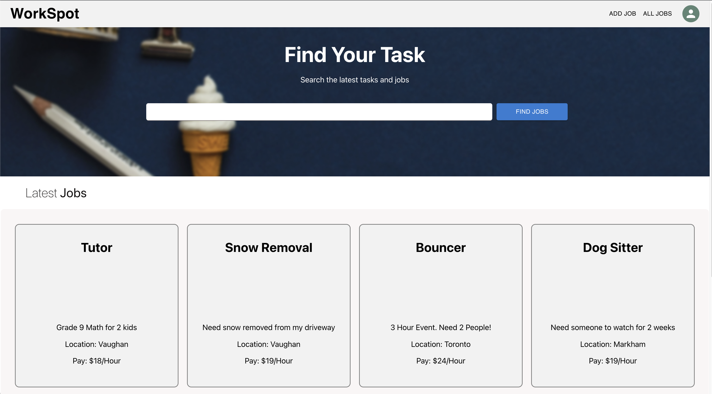
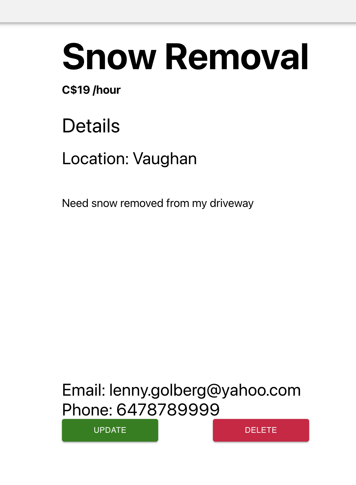
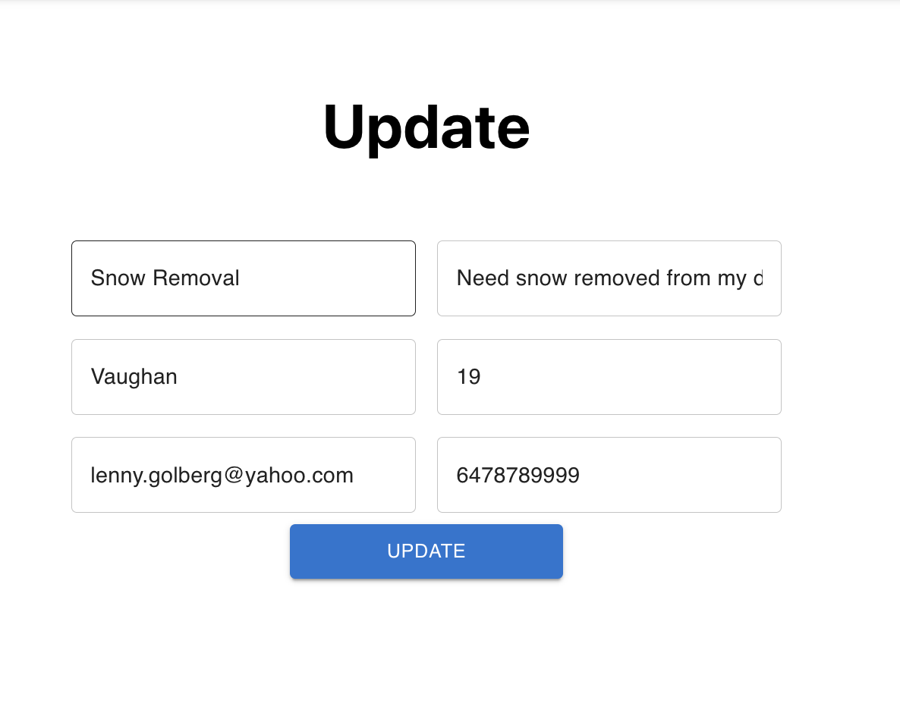
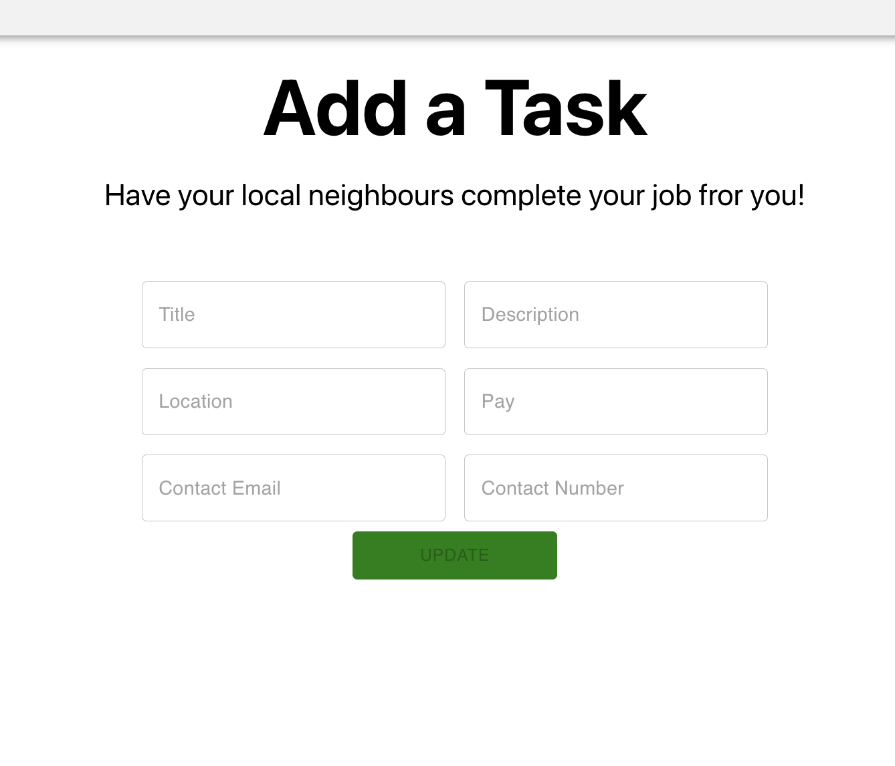
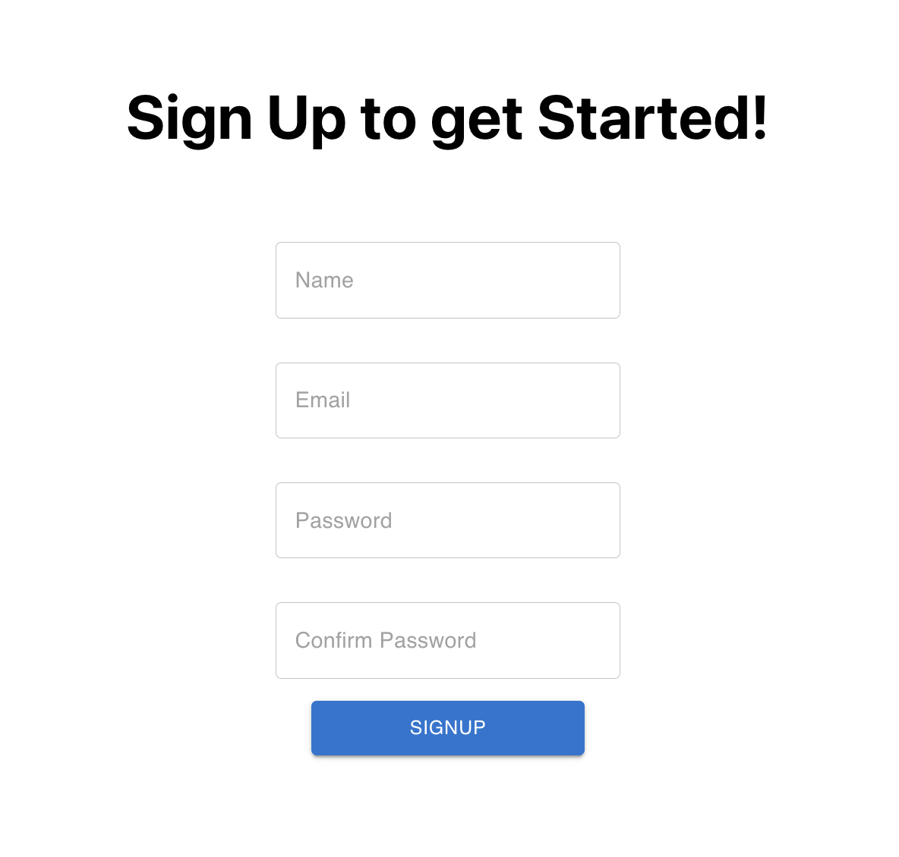

<h1>WorkSpot</h1>

WorkSpot is a web application that provides a platform for finding and posting short-term jobs or tasks, such as shoveling driveways or walking a neighbor's dog. It was created with the intention of helping students and other individuals earn extra money on the side, without the need for a long-term or part-time job commitment.

The idea for WorkSpot first came about when I was in high school and university, and was looking for ways to earn extra income. I realized that there were a lot of people in my community who needed small tasks done, and that this presented an opportunity to connect those in need with those who could complete these tasks.

<h2>Technologies Used</h2>

 
 
 
 
 
 
 
 
 
# <h2>Screenshots</h2>

<h2>Getting Started</h2>

<a href="https://workspot-apps.herokuapp.com/login">WorkSpot Application</a>

<a href="https://trello.com/b/lCcHZUGh/project-4">Trello Board</a>

<h2>Next Steps</h2>

<ul>
  <li>Restrict User's to only update or delete their own Job posting</li>
  <li>Image Upload Capability</li>
  <li>Search functionality</li>
  <li>Filter functionality</li>
  <li>Create a Mobile dedicated version</li>
</ul>
